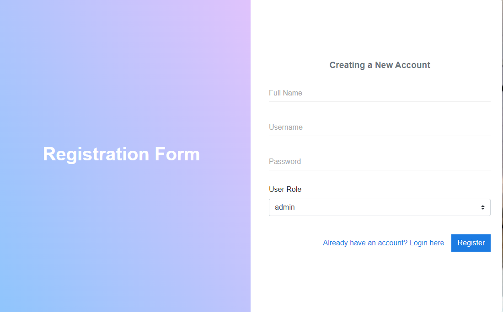
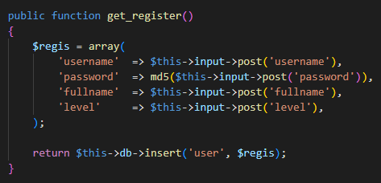
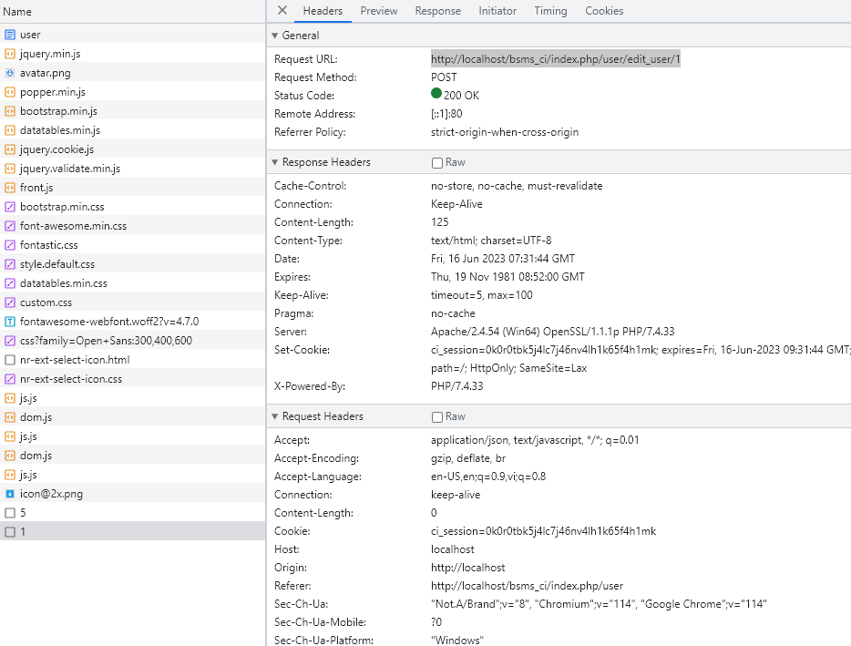
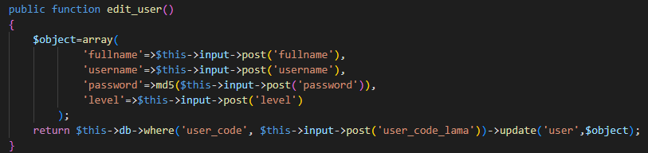
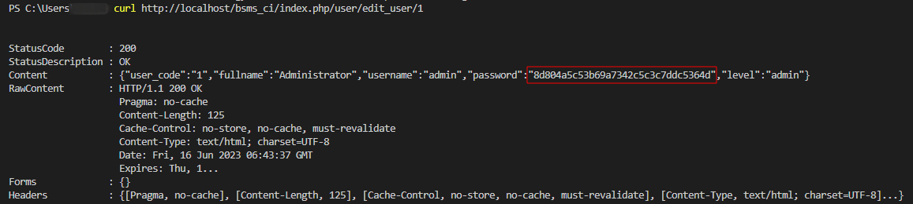

# SourceCodester Book Store Managerment System Information

<aside class="mdx-author" markdown>
![@squidfunk][@squidfunk avatar]

**Nho Tran** · @nhott

:octicons-calendar-24: Oct 5, 2022 ·
:octicons-clock-24: 3 min read

</aside>

  [built-in search plugin]: ../../setup/setting-up-site-search.md#built-in-search-plugin
  [@squidfunk avatar]: ../../assets/author/nhoicon.png
  [insiders-4.14.0]: ../../insiders/changelog.md#4.14.0

---

A vulnerability classified as problematic has been found in SourceCodester Book Store Management System 1.0. This affects an unknown part of the file /bsms_ci/index.php/user/edit_user/. An Unauthenticated Password Hash Disclosure vulnerability has been identified, which can be exploited to retrieve the password hashes of all existing user accounts. The manipulation of the argument password leads to information disclosure. It is possible to initiate the attack remotely. The exploit has been disclosed to the public and may be used.

## Introduction

Book Store Management System is a CodeIgniter Project application that aims to provide an automated online platform for bookstores to manage their sales transactions and records.

## Analysic

The Book Store Management System is only accessible to the store's management. It contains 2 types of user roles which are the Administrators and the Cashiers. The admin users have permission to access and manage all the data on the system including the list of the book categories, books, and users. The cashier users are only allowed to create transactions with the customer.

Analysic the get_register() function detect passwords encrypted as MD5, that using MD5 for password hashing is generally considered insecure. Additionally, the code snippet doesn't include any input validation or protection against potential security vulnerabilities such as SQL injection.

After successfully logging into the system and querying user information, with the edit function the information will send the query to http://localhost/bsms_ci/index.php/user/edit_user/{id} 

Analysic the edit_user(), the function retrieves input values for the user's full name, username, password, and level from the form or request.
The function creates an array named $object that holds the updated user data. The array includes the full name ('fullname'), username ('username'), the MD5 hash of the password ('password'), and the user's level ('level').
The function uses the CodeIgniter framework's database library to update the 'user' table. It updates the row that matches the provided 'user_code' with the $object data.
The function returns the result of the database update operation.
It's important to note that using MD5 for password hashing.

Try sending a request to edit the use we obtain an MD5 hash code of the password. We can successfully decrypt the password using tools such as decoding or brute-force methods.

## Affected

/bsms_ci/index.php/user/edit_user/{id}

