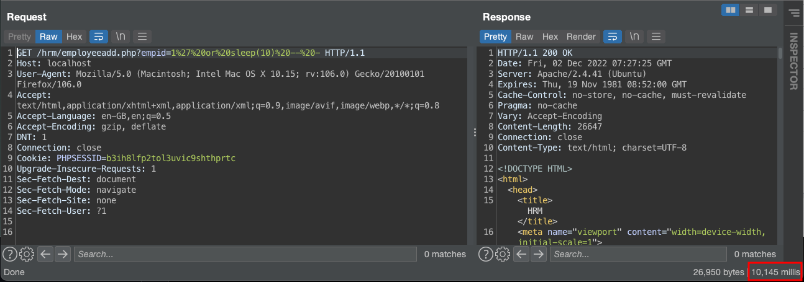
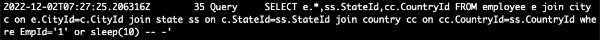

# SourceCodester Human Resource Management System employeeadd.php sql injection

<aside class="mdx-author" markdown>
![@squidfunk][@squidfunk avatar]

**NGO VAN TU** · @tusnj

:octicons-calendar-24: December 03, 2022 ·
:octicons-clock-24: 5 min read ·

</aside>

[built-in search plugin]: ../../setup/setting-up-site-search.md#built-in-search-plugin
[@squidfunk avatar]: ../../assets/author/tuicon.png
[insiders-4.14.0]: ../../insiders/changelog.md#4.14.0

---

## Introduction

Human Resource Management System is a web application that was developed in PHP and MySQL Database. It aims to provide an online automated platform for certain company employees' to manage or submit their leave applications. It has a pleasant user interface with some gradient color and uses Bootstrap and Responsee Framework for the page designs.

[CVE-2022-4278](https://www.cve.org/CVERecord?id=CVE-2022-4278) is a vulnerability classified as critical has been found in SourceCodester Human Resource Management System 1.0. Affected is an unknown function of the file /hrm/employeeadd.php. The manipulation of the argument empid leads to sql injection. This vulnerability is traded as CVE-2022-4278. It is possible to launch the attack remotely. Furthermore, there is an exploit available.

## Understanding

A vulnerability was found in SourceCodester Human Resource Management System 1.0. It has been rated as critical. This issue affects an unknown functionality of the file /hrm/employeeadd.php. The manipulation of the argument empid with an unknown input leads to a sql injection vulnerability. Using CWE to declare the problem leads to CWE-89. The software constructs all or part of an SQL command using externally-influenced input from an upstream component, but it does not neutralize or incorrectly neutralizes special elements that could modify the intended SQL command when it is sent to a downstream component. Impacted is confidentiality, integrity, and availability.

The weakness was published 12/03/2022 by Ngo Van Tu. It is possible to read the advisory at github.com. The identification of this vulnerability is CVE-2022-4278. Technical details as well as a public exploit are known. The attack technique deployed by this issue is T1505 according to MITRE ATT&CK.

## Affected

The product(s): https://www.sourcecodester.com/php/15740/human-resource-management-system-project-php-and-mysql-free-source-code.html

Affected product(s)/code base: https://www.sourcecodester.com/sites/default/files/download/oretnom23/hrm.zip

Affected component(s): /hrm/employeeadd.php

## Technical Details

### System Installation/Setup

1. Open your XAMPP Control Panel and start Apache and MySQL.
2. Extract the downloaded source code zip file.
3. Copy the extracted source code folder and paste it into the XAMPP's "htdocs" directory.
4. Browse the PHPMyAdmin in a browser. i.e. http://localhost/phpmyadmin
5. Create a new database named hrm_db.
6. Import the provided SQL file. The file is known as hrm_db.sql located inside the db folder.
7. Browse the Human Resource Management System in a browser. i.e. http://localhost/hrm/.

### Proof of Concept

Login as admin and go to http://localhost/hrm/employeeadd.php

Execute Payload SQLi with injection:

`/hrm/employeeadd.php?empid=1%27%20or%20sleep(1)%20--%20-`

The database will sleep 1 second before return data to the web application

In the other hand, execute payload sleep(10) will make database sleep 10 seconds before return data

`/hrm/employeeadd.php?empid=1%27%20or%20sleep(1)%20--%20-`

### Analysis with SQL log

We back to SQL log and see what exactly executed in the server.

The query `SELECT e.*,ss.StateId, cc.CountryId FROM employee e join city c on e.CityId=c.CityId join state ss on c.StateId ss.StateId join country cc on cc. CountryId=ss. CountryId where EmpId=<empid here>`

## CVE Reference

[https://www.cve.org/CVERecord?id=CVE-2022-4278](https://www.cve.org/CVERecord?id=CVE-2022-4278)